## Steganography
### Plane Sight

The Plane Sight challenge was initially one challenge. However, when it became apparent that we couldn't solve it, they made it into two challenges.

The first thing I did was to use the `file` command to check the image and confirm that it was indeed a JPEG image. Then, I used the `strings` command to see any content, but the results were all clunky. But then I saw something related to `exiftool`.

Then what I did was to use the `exiftool` tool to check the image.
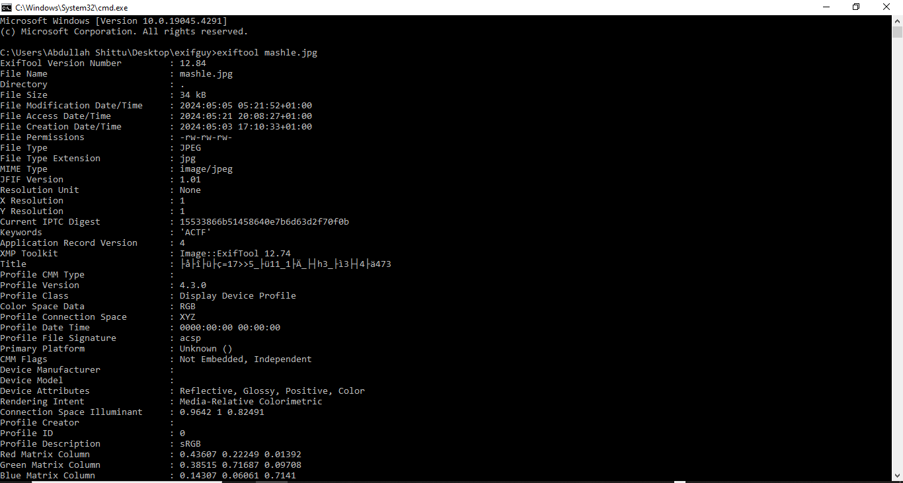

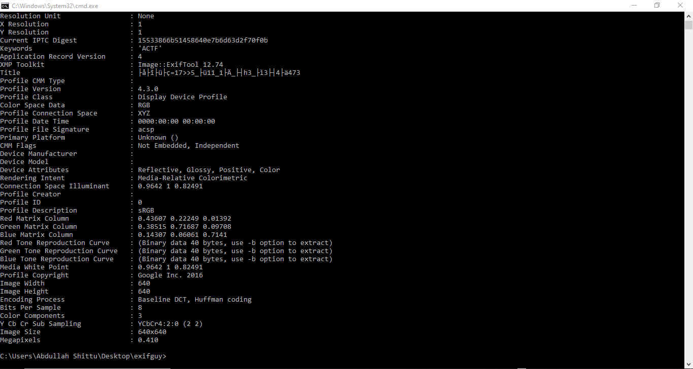


I got some encoded words/string in the title section.

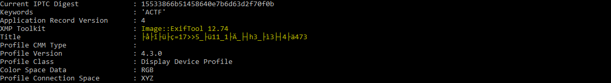


We also received some hints in the notifications that the encoded words are in Cyrillic, similar to the cryptography challenge.


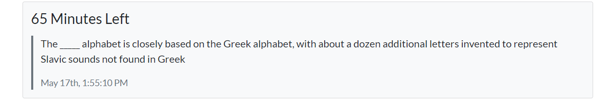


I also utilized https://www.aperisolve.com/ to inspect the image.

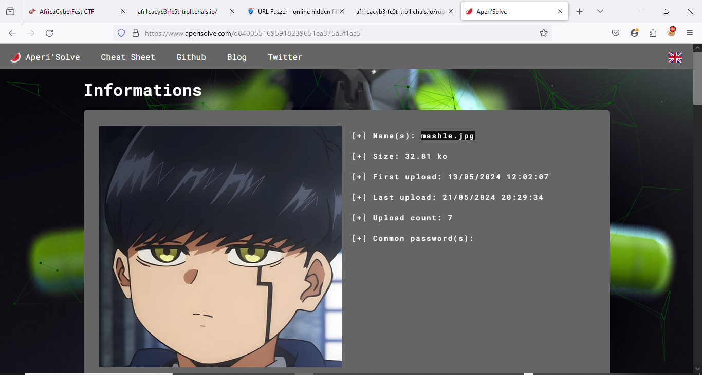

I found something similar in the title section using ExifTool. I then posted this on ChatGPT and received an HTML encoded string.


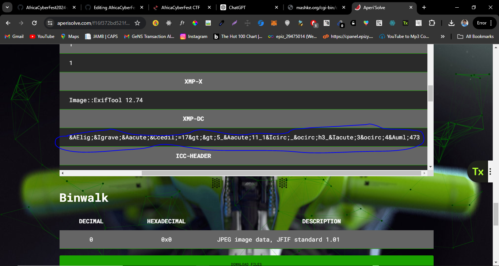

I then posted this on ChatGPT and received an HTML encoded string.
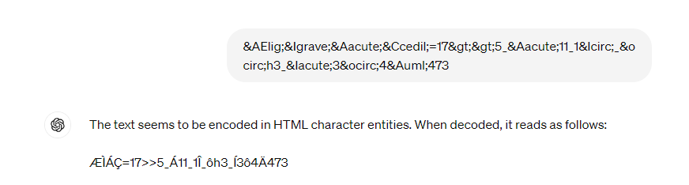


Then, I followed the same process as I did in the cryptography challenge. I posted the encoded string on the automatic Cyrillic decoder at mashke.org.
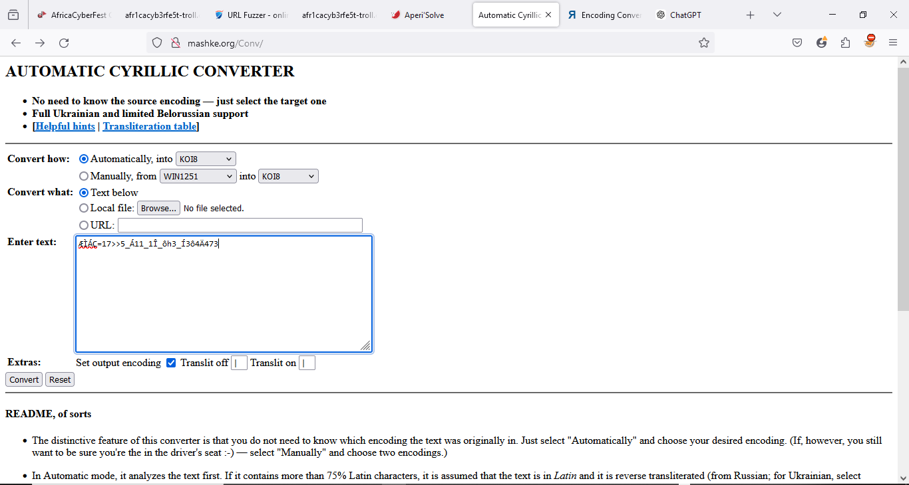

Then, when I converted the page, it automatically translated from Bulgarian/Russian to English.


But I still had to be sure, so I used Google to detect it.
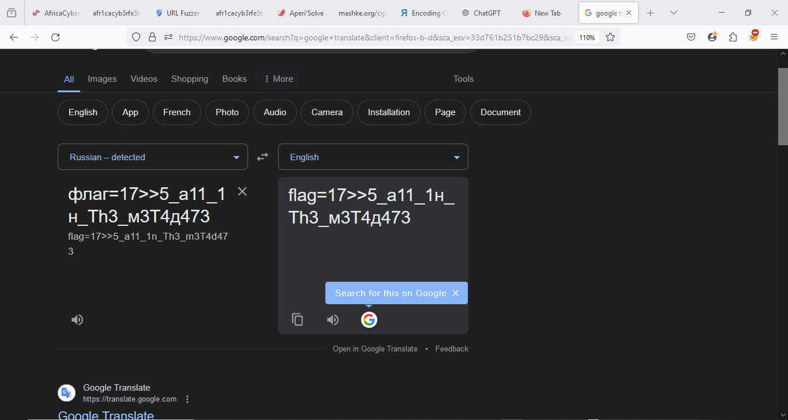

I confirmed that it was indeed Serbian. I translated it to English.
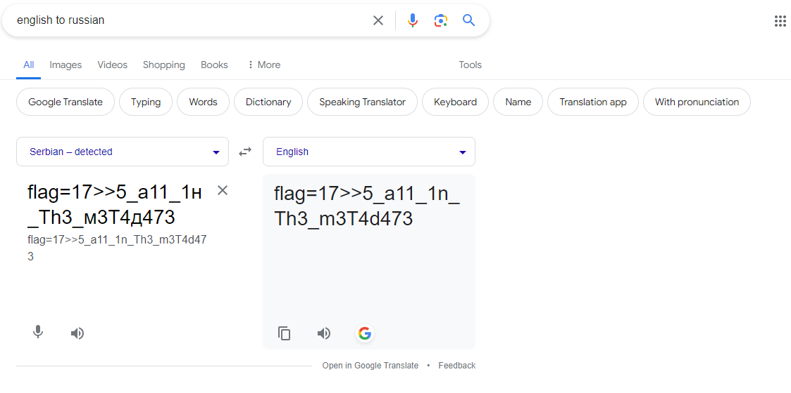

I tried using this as the flag, but it didn't work. I left it for a while, thinking a bitwise operation like "17>>5" might be involved. Later, I got a hint/idea to use other Cyrillic encoders. Then I used https://convertcyrillic.com/#/.


I did lots of trial and error here, but when I used KOI-8 to Phonetic (Modified Library of Congress Transliteration) [Russki\i ^iazyk], I got another string. I tried this string, and I was surprised to see it was the flag.

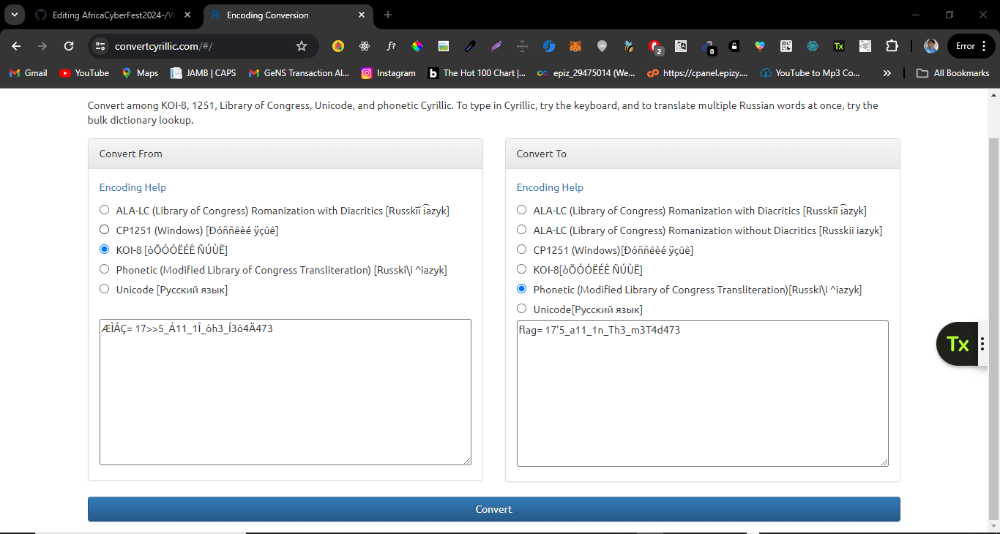

```
Flag: ACTF{17'5_a11_1n_Th3_m3T4d473}
```
