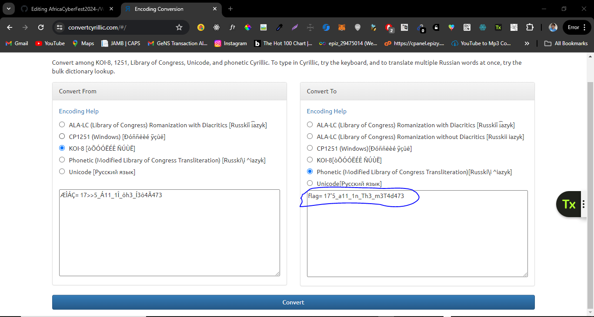

### S1mple


I downloaded the simple.txt file and upon opening it, I noticed whitespace encoding beneath the binary content. Subsequently, I employed the stegsnow tool in my Kali Linux environment to proceed with analysis.


I cross-checked it on my Kali Linux environment, then used the file command on the simple.txt file to verify if it was indeed a text file. Afterward, I ran the strings command on the simple.txt file and obtained the same output.


Then I employed the stegsnow tool with the -C simple.txt command to scrutinize the image.


If stegsnow isn't installed, you can install it using the appropriate command for your system."
To install stegsnow on Kali Linux, you can use the following command in your terminal:


sudo apt-get install stegsnow


I then copied the cipher to the website mashke.org, which provides an automatic Cyrillic encoder. I tried several encodings, but when I used the Windows-1251 encoding, I successfully obtained the flag, which was translated from Russian to English.


Boom! I got the flag.

```
Flag: ACTF{1ts_ju57_a5_5impl3_4s_1t_100k5!!!}
```
